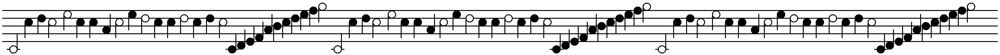

# Optical music recognition

## Introduction

The task is to parse the notes contained in a sheet of music given as a run-length encoded string.

RLE images are formatted as follows :

```
"W {white_pixels_count} B {black_pixels_count} ..."
```

It simply switches between `W` and `B` (for white and black pixels), followed by the number of continuous pixels containing the same value.

The music sheet received as argument must be **clean**, meaning containing only 100% black or white pixels, notes are separated by at least one pixel, the space between the lines is at least 8 pixels, and at least 4 times the height of a line, lines are parallel between each others, the image doesn't contain noise, all notes have a tail, and notes must either be halves or quarters.

Here's an example of image that the current algorithm is able to parse :



Full description of the task can be found on the [coding game puzzle](https://www.codingame.com/training/expert/music-scores) page

## Requirements

- gcc ^11.3.0
- cmake ^3.22.1

## Build and run

### Build

**Step required only if you want to debug images**
Set the `DEBUG_IMAGE` variable to `TRUE` in the `CMakeLists.txt` file located at the project's root, and set the path in which you want the debu images to be stored.

**Required**
Create a `build` folder at the project's root.

Open a terminal in the `build` folder and run

```shell
cmake .. && make
```

### Run

You can try the program with the provided examples (taken from [here](https://files.codingame.com/pub/dw/dw2-allimages_fr.html)) or encode another image in RLE, as long as it respects the requirements listed above for an image to be clean.

You can store the image in the `build` folder, or `static/input_files` but you'll need to rebuild the project so that static files get collected.

Else you can use any other folder as long as you give its absolute path as argument when running the script.

Run the program from the `build` folder with

```shell
./orm $width $height $file_path
```

For example :

```shell
./omr 120 176 in1.txt
```

**Note:**

Each image has its height and width written in the `static/input_files/README.md` file.


### Tests

From the build folder, you can run several test scripts :

#### Unit tests

```shell
./grid_test
```


```shell
./region_of_interest_test
```


```shell
./rle_parser_test
```

### End to end tests

```shell
./omr_test
```

## Data structures

### Grid

A grid is a wrapper to store a 2d binary table extended with util functions (get width and height, get columns and rows, get pixel, get subgrid).

Each cell is `true` if the pixel is on, else `false`

### Region of interest

A region of interest (ROI) is an area in a picture containing relevant information.

The broadest ROI is the picture itself, the smallest ROIs are the areas in which individual keys can be found.

A ROI is composed of :

- one x-y offset vector (computed from the ROI's upper left corner's coordinates, the origin [0, 0] being the global image's upper left corner)
- absolute width and height of the region
- two histograms, storing the quantity of black pixel in each rows and columns respectively

### RLE parser

The RLE parser is in charge of extracting significant data from the RLE string.

It fills in a 2D grid and computes horizontal - vertical distributions as it reads the RLE string.

It uses the generated 2d grid and distributions to create the global region of interest.

### Optical Music Recognition

It's the main class of the project. It is in charge of reading the rle source and extract the individual notes from it.

#### High level algorithm

- Convert the rle string to a 2d binary grid
- Compute horizontal and vertical distributions of black pixels
- Reference the image as a region of interest
- Crop the main region of interest to set its limits to first & last non empty rows & columns
- Compute the lines height, interlines height, and reference notes horizontal axes 
- Iterate over column distributions to find the individual notes x coodrinates
- Locate the y coordinates of the tail of the note in each note area
- Locate the note horizontal axis, either at the beginning or the end of the tail
- Assign the note its name by finding the index of the reference notes axes that minimizes the distance to the note horizontal axis
- Assign the note its length by checking if the pixel located at the center of the note is black or white
